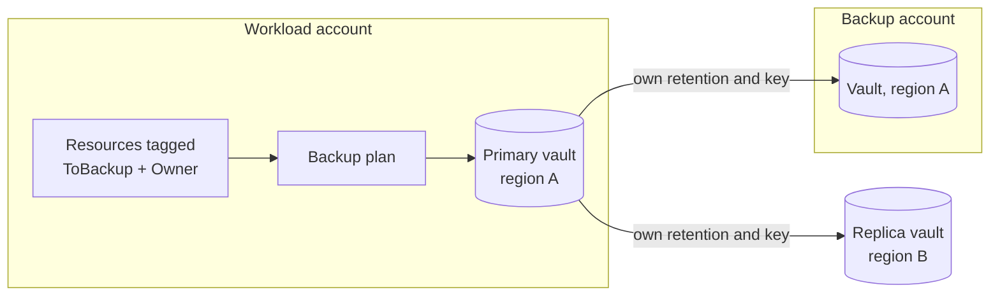

# terraform-aws-backup-policy

Tag-driven AWS Backup policy with cross-region and cross-account copies, a customer managed key per vault, and Vault Lock.

One module call gives an account a backup plan, three vaults, the IAM role to run jobs, and the vault policy that lets the workload account copy into the backup account without being able to read or delete anything there.



Separate keys are not decoration. KMS keys are regional, so a copy into region B is re-encrypted under a region B key, and a copy into another account uses a key that account controls.

Provider setup and a worked configuration are in [`examples/complete`](examples/complete).

## Things that silently break AWS Backup

**Resource types are opt-in per account and per region.** Several are opt-out by default, and a tag selection skips anything not opted in without raising an error. The plan looks healthy and protects nothing. Set `manage_region_settings = true` in exactly one configuration per account.

**S3 needs its own IAM policies.** `AWSBackupServiceRolePolicyForBackup` does not cover it. A correctly tagged bucket is skipped until `AWSBackupServiceRolePolicyForS3Backup` is attached. The module attaches it whenever S3 is in `opt_in_resource_types`.

**Nobody notices a failing plan.** A backup plan reports nothing when jobs fail, so set `notification_topic_arn` and subscribe the on-call rotation. The default event list is the failure set plus `RECOVERY_POINT_MODIFIED`. Topics are regional, so the replica region needs its own.

**Cold storage has a 90 day floor.** AWS rejects any lifecycle where `delete_after` is below `cold_storage_after + 90`. The module checks this at plan time on the rule and on both copies, so it fails in seconds rather than at the first scheduled run.

## Vault Lock

Governance is the default. It blocks deletion by ordinary principals and stays removable by someone holding `backup:DeleteBackupVaultLockConfiguration`.

Compliance mode is worth understanding before enabling it. Once `changeable_for_days` elapses the lock cannot be removed by you, your root user, or AWS support, retention cannot be shortened, and the vault cannot be deleted while it holds recovery points. `terraform destroy` fails permanently and storage keeps billing until retention completes.

That immutability is the point for a regulated workload and the reason it is not the default: the first person to run this in a test account cannot undo it, so the choice belongs in the environment configuration. The tradeoff is that a governance lock can be removed by a sufficiently privileged attacker, and anything that must survive that needs compliance mode.

In the AWS API, passing `changeable_for_days` is what selects compliance mode, so the module maps a readable `mode` onto that.

## Inputs

| Name | Type | Default | Notes |
|---|---|---|---|
| `name` | `string` | required | Base name for vaults, plan, aliases, role |
| `source_account_id` | `string` | required | Runs the backup jobs |
| `vault_account_id` | `string` | required | Receives cross-account copies |
| `rules` | `list(object)` | required | Schedule, retention, copy behaviour |
| `selection_tags` | `map(string)` | `{ ToBackup = "true" }` | ANDed, not ORed |
| `owner_tag_value` | `string` | `null` | Value required on the `Owner` tag |
| `vault_lock` | `object` | governance, 7 to 3650 days | See above |
| `opt_in_resource_types` | `map(bool)` | ten common types | |
| `manage_region_settings` | `bool` | `false` | One configuration per account |
| `notification_topic_arn` | `string` | `null` | SNS topic for vault events in the primary region |
| `replica_notification_topic_arn` | `string` | `null` | Separate topic, because SNS topics are regional |
| `notification_events` | `list(string)` | failure events | Which vault events are published |
| `kms_deletion_window_days` | `number` | `30` | |
| `tags` | `map(string)` | `{}` | |

## Outputs

`plan_id`, `plan_arn`, `vault_arns`, `kms_key_arns`, `backup_role_arn`, `selection_tags`, `vault_lock`.

`vault_lock` reports the effective mode and whether the lock is still reversible, which is the awkward question during an audit.

## Requirements

Terraform >= 1.5, AWS provider >= 5.40, and three configured aliases: `aws.primary`, `aws.replica`, `aws.vault_account`.

```
cd examples/complete
terraform init -backend=false
terraform validate
python ../../tools/check_diagram.py
```

The last one fails if the module gains a resource the README stops mentioning.

The input guards have negative tests behind them: a lifecycle under the cold storage floor, a compliance lock with less than 3 days grace, and duplicate rule names are all rejected before anything reaches AWS.
